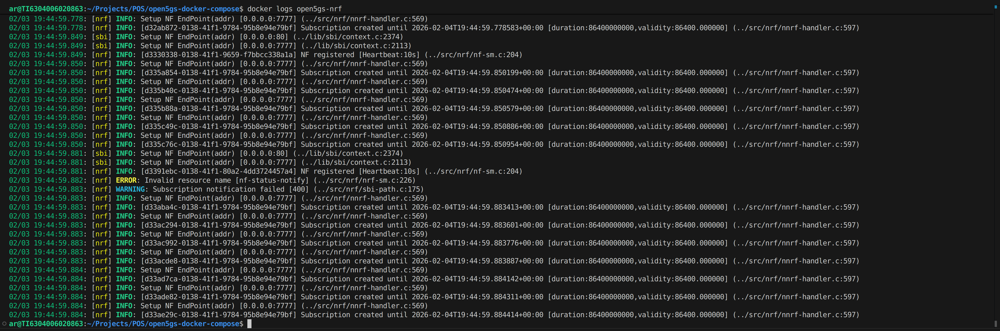
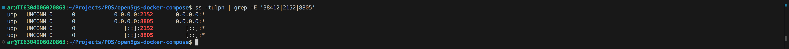

# Projeto: Implantação do 5G Core (Open5GS) com Docker

Este repositório contém os arquivos necessários para a implantação de um **5G Core Standalone (SA)** utilizando o **Open5GS** em um ambiente orquestrado por **Docker Compose**. Este projeto foi desenvolvido como parte de um laboratório voltado para cenários de **OpenRAN**.

## Objetivo
Implantar e validar um ambiente de Core 5G operacional, estável e reprodutível, garantindo que os serviços estejam prontos para integração futura com uma RAN (ex.: gNB e UE via UERANSIM).

---

## Estrutura do Projeto

*   `docker-compose.yml`: Definição central da infraestrutura e serviços (NFs do 5G Core).
*   `.env`: Arquivo de parametrização de versões e portas expostas.
*   `config/open5gs/`: Pasta contendo os arquivos de configuração YAML para cada Network Function (AMF, SMF, UPF, etc.).
*   `start.sh` / `stop.sh` / `reset.sh`: Scripts para automação da inicialização, desligamento e limpeza total do ambiente.
*   `doc/images/`: Pasta contendo as evidências coletadas na execução.

---

## Pré-requisitos
*   **Sistema Operacional**: Host Linux (Recomendado: Ubuntu 22.04 LTS ou superior).
*   **Docker Engine**: Instalado e configurado.
*   **Docker Compose**: Versão V2 ou superior.

---

## Configuração e Parametrização

O projeto utiliza um arquivo `.env` para gerenciar as versões das imagens e as portas mapeadas no host. 

**Variáveis Principais:**
*   `OPEN5GS_VERSION`: Versão do Core (Ex: 2.7.6).
*   `AMF_NGAP_PORT`: Porta 38412/SCTP usada pela gNB para se conectar ao AMF (Interface N2).
*   `UPF_GTPU_PORT`: Porta 2152/UDP usada para o plano de usuário (Interface N3).
*   `WEBUI_PORT`: Porta de acesso ao painel administrativo (Default: 9999).

---

## Execução do Ambiente

Para facilitar a operação, utilize os scripts automatizados:

1.  **Subir o Core:**
    ```bash
    chmod +x start.sh
    ./start.sh
    ```
    *Isso inicializará o banco de dados (MongoDB) e todas as Funções de Rede (NFs).*

2.  **Descer o ambiente:**
    ```bash
    chmod +x stop.sh
    ./stop.sh
    ```

3.  **Reset Total (Limpeza):**
    ```bash
    chmod +x reset.sh
    ./reset.sh
    ```
    *Oferece um menu para apagar containers e/ou as imagens baixadas.*
---

## Validação e Coleta de Evidências

Para comprovar que o Core está operacional, siga os passos abaixo:

### 1. Verificar Containers em execução
```bash
docker compose ps -a
```
*Esperado: Todos os containers (mongodb, nrf, amf, smf, upf, ausf, udm, udr, pcf, nssf, webui) devem estar com status `Up` e `Healthy`.*

### 2. Verificar Logs de Inicialização
Você pode verificar se os serviços se registraram corretamente no NRF:
```bash
docker logs open5gs-nrf
```
*Busque por mensagens indicando o registro bem-sucedido das NFs.*

### 3. Verificar Conectividade e Portas
Confirme se as portas críticas de integração com a RAN estão expostas no host:
```bash
# Verificar portas SCTP (NGAP) e UDP (GTP-U)
ss -tulpn | grep -E '38412|2152|8805'
```

---

## Network Functions Implementadas

*   **MongoDB**: Banco de dados de assinantes.
*   **NRF**: Repositório de funções para descoberta de serviços.
*   **AMF**: Gerenciamento de acesso e mobilidade (Interface com gNB).
*   **SMF**: Gerenciamento de sessões de dados.
*   **UPF**: Processamento e encaminhamento do tráfego do usuário.
*   **AUSF / UDM / UDR**: Autenticação e gestão de dados unificados de assinantes.
*   **PCF**: Controle de políticas e QoS.
*   **NSSF**: Seleção de fatias de rede (Network Slicing).

---

## Evidências coletas na execução

### Containers em execução


### Logs de inicialização



### Portas expostas



---

## Referências

* [Open5GS](https://open5gs.org/)
* [Open5GS Docker](https://github.com/open5gs/open5gs/blob/master/doc/docker/README.md)

---

**Responsável**: Alessandro Rocha
**Data**: 03 de Fevereiro de 2026